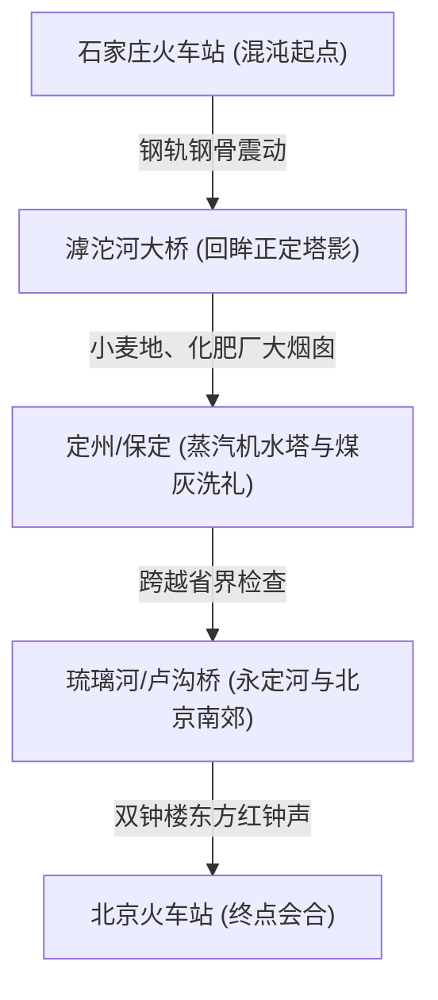
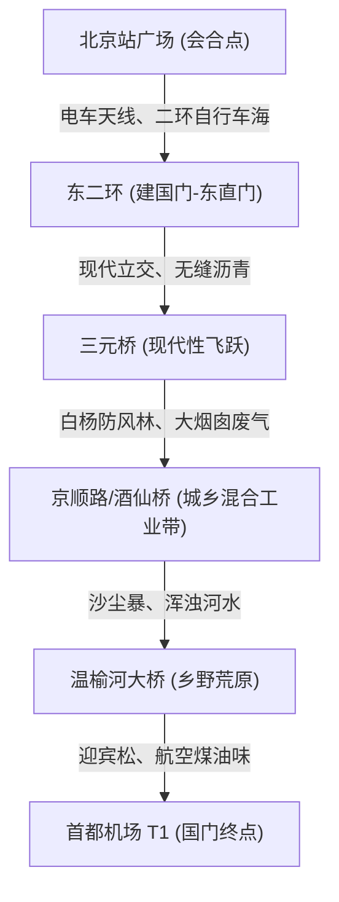

# 1985 年中美 CA981 出洋及艾奥瓦考察客观史实细节白皮书（终极无损版）

---

## 👤 一、 考察团 5 位成员的【真实生平、精神指纹与行为风貌】

这五位出访成员在真实历史中有着极其鲜明、饱满的生平，且在 20 世纪 80-90 年代留下了他们最真实的文字与精神指纹：

### 1. 团长：习近平（31岁，时任河北省正定县委书记，对外使用“石家庄地区食品协会主席”头衔）
*   **出访动机**：正定当时是华北平原的农业大县，但饲料工业一片空白，生产方式落后。习近平此行的核心目的就是**“寻找能够改变正定落后面貌的农业和饲料深加工技术”**。
*   **个人作风与特点**：性格沉稳、谦逊、极度务实与简朴。在国内习惯“骑自行车下乡调查”。在美期间，脸上始终挂着**“不会停止的微笑”（a smile that wouldn't stop）**，眼神温和明亮，待人接物极其大度。
*   **【震撼画面】在农场泥地上用手指画图**：在走访现代养猪场和饲料厂时，当复杂的专业术语（如饲料配比、母猪产仔率）连翻译也一时卡住难以翻译时，习近平并没有放弃，而是俯下身子，**用手指直接在农场的湿泥地上画出示意图**，或者用手势与美国农场主直接探讨技术细节，这种务实专注赢得了美方极大尊敬。

### 2. 随团正式唯一翻译：夏文义（20多岁，时任石家庄地区外事办秘书）
*   **【真实史实：他完成了全程翻译！】**：在真实历史中，**夏文义身体健康，顺利且功勋卓著地完成了全程 12 天的翻译和外事协调工作**。在没有第二名翻译的情况下，他需要在农场、饲料厂和宴会上进行高强度的交替传译。美方协调员卢卡·贝隆回忆他“非常敬业、工作极其繁重但始终保持礼貌”。退休前的真实职务为**河北省委宣传部副巡视员**。
*   **真实的穿着言行**：精神高度紧张，腋下死死夹着一本翻得起毛开线的绿皮《汉英大词典》（商务印书馆出版），满头大汗地背诵“饲料转化率（Feed conversion ratio）、青贮玉米（Maize silage）、赖氨酸（Lysine）”等农业词汇，用一块黄棉布手绢擦汗。他穿着一身明显大了一号、裤腿像水桶一样肥大的深蓝色涤纶西装，左袖口那张蓝色长方形标签完好无损地保留着。
*   **灵魂立柱（跨文化对比指纹）**：**夏文义于 2012 年由五洲传播出版社出版了跨文化比较著作——《美国与中国的 133 个不同》（*133 Differences between the U.S. and China*）！**
    这证明他的“对比狂”种子是在 1985 年那场极其紧张的 CA981 出洋中深埋下的。在旅途中，他随身带着一个小本子，随时随地在上面分两栏手写对比日常生活中最微小的不同（如“美国人直接喝冰水/中国干部喝开水；盖CAAC毯子摩擦产生的静电/美式冷气的轰鸣”），这正是他三十年后写出著作的最早思想胚胎。

### 3. 白润璋（40岁，时任河北省束鹿县县长）
*   **真实履历**：白润璋（1944年11月生），出访时任河北省束鹿县（现辛集市）县委副书记/县长。回国后接任束鹿县委书记，1986年3月辛集撤县设市后任首任辛集市委书记，此后历任石家庄地委副书记兼行署专员、衡水地委书记、唐山市委书记（1998-2003），官至**河北省人大常委会副主任**。
*   **真实文字指纹**：天津工学院化工系燃料化学工学专业毕业生。属于典型的“重工业技术官员”。文风充斥着*“固定资产原值”、“综合能耗下限”、“煤气化炉技术改造”、“折旧率测算”*等公式论证。在飞机上，他神情紧绷，一直在用随身带的“英雄牌”钢笔在红塑料皮的笔记本上计算美国的饲料转化率和玉米深加工产量公式。笔尖在气压变化下隐隐漏水，弄得他大拇指和食指上全是一块块深蓝色的墨渍，他只能不断用的确良袖口去擦拭。
*   **灵魂立柱（隐藏特质）**：**他在真实历史中是一位极具造诣的摄影艺术家**，退休后曾举办过多场个人摄影展并出版画册。他拥有极其独特的**“摄影镜头视线”**——他不仅是用化学公式打量世界的重工业技术官僚，他的视线还在本能地寻找光影构图、机械线条的比例和反差。他会用的确良衣角，默默擦拭他的**海鸥牌照相机**镜头。到了美国马斯卡廷德沃查克家寄宿时，因为局促和害怕弄脏美国家庭精美的地毯，他甚至**“垫着脚尖”走路**。
*   **新皮鞋与西装上的荒诞细节**：他穿着一身发硬的灰色涤纶混纺西装，**左袖口上蓝色“100% Wool”长方形纸商标并没有剪掉**，西装背后的“X”形白色缝合定位线也死死保留。脚上是一双崭新的**红星牌黑色牛皮三接头皮鞋**。皮质发硬，后跟处的皮革死死勒着他的脚踝，走路时脚后跟微微拖地，强忍痛苦地僵硬微笑。

4.  **刘录清（时任石家庄地区科委副主任）**
    *   **真实履历**：学者型技术官员，温和、求知欲强。回国后，他长期致力于地方科技管理与科学史料整理，主持并亲自参与了**《石家庄地区科学技术志》（1991年出版）**的编纂工作，担任主编之一。
    *   **真实文字指纹**：他的文字带有强烈的**“记录性、考据癖、目录化和历史大纵深感”**。文风充斥着*“格物致知”、“技术沿革”、“始末考”、“设备折旧”、“引进批号”*。他执着于记录每个技术节点的“第一人”与“绝对数据”。
    *   **灵魂立柱（考据特质）**：他就像一个随身携带着刻度尺和温度计的精密仪器。在安检处，他甚至想凑上去研究那个黑色橡胶传送带的运转轴承和红外扫描仪的型号，被边警严厉呵斥。在客舱中，他扁平地捏住中华烟过滤嘴，极其严肃地大口抽烟，把烟灰当成化学实验一样极度精确地弹进座椅扶手里那个铜质的翻盖烟灰缸里。
    
5.  **于锡庆（时任石家庄地区经委主任）**
    *   **真实履历**：资深行政协调与经济规划专家，在石家庄地区负责统筹工业生产、技术改造与原材料调度。
    *   **真实文字指纹**：典型的“重工业大管家式”文风，高度务实。文风充斥着*“煤电运综合平衡”、“原材料缺口统筹”、“指标调拨”、“盈亏临界点”*等计划经济实体物资的物理重量。
    *   **灵魂立柱（务实做派）**：在客舱和机场中，他会本能地用“这得耗费多少煤电、换算成咱们石家庄的原料指标是多少”的经委盈亏大管家逻辑来衡量一切美式效率。他拒绝穿西装，认为束手束脚，坚持穿一整套**熨得笔挺的深蓝色的确良卡其布中山装**，口袋里插着两支钢笔。在飞机上，他对于免费供应的茅台酒表现出了极大的热情，客气地跟乘务员微笑，用粗哑的嗓音说：“同志，再给整两盅。”他在太平洋上空遭遇剧烈气流颠簸时生理防线彻底崩溃，大口呕吐。

---

## 🚏 二、 出发出洋的交通与首都机场 T1 空间快照

1.  **石家庄到北京的绿皮火车**：代表团在石家庄市内出行特配上海牌轿车和吉普车，但北上北京使用的是**大风沙和煤焦油味交织的绿皮火车**。
2.  **出国前集训与置装**：代表团在北京的**外交部招待所**（或**河北宾馆/河北招待所**）进行为期数天至一周的“出国前集训”，房间散发着陈年石灰墙的土腥气和湿漉漉的竹席霉味。期间，每人拿到国家统一发放的“置装费”（200元），集体前往北京友谊商店或王府井百货大楼，购买了西装，西装散发着化纤强烈的甲醛氟味。
3.  **前往机场：京顺路的黄沙大巴**：
    *   清晨坐上一辆由外事办安排的老式**绿白相间进口丰田考斯特（Coaster）中巴**。
    *   走的是狭窄的双向两车道**京顺路（北京—顺义）**，两旁立满漫天飞沙中挺立的华北白杨树。一路上中巴必须不断疯狂按喇叭超越慢吞吞的农用柴油拖拉机（突突突冒着刺眼黑烟）、拉煤平板车和毛驴货车。车窗渗沙，车内充满了焦油烟雾、汽油尾气和焦糊座套味，颠簸足足 1.5 到 2 小时。
4.  **首都机场一号航站楼（T1）物理空间**：
    *   **光影与材质**：大厅顶上是发青、发冷、嗡嗡作响的日光灯管，候机椅是冰冷坚硬的深绿色和暗橙色塑料连排椅。
    *   **被遮挡的裸体壁画**：大厅中央悬挂着袁运生 1979 年落成的先锋壁画《泼水节——生命的赞歌》。1985 年正值整改后期，**壁画上的裸体关键部位被几块政治性的木板死死遮挡**。
    *   **翻页信息牌与免税店的“玻璃势差”**：巨大的黑白翻页式航班信息显示牌（Solari Board）每当航班变动，就会发出“刷刷刷刷”如暴雨拍窗般的机械翻牌声。大厅一角的免税店只接受**外汇券**，用明亮的玻璃柜台展示着洋烟洋酒，穿着笔挺蓝色制服的售货员神态冷傲，普通干部只能隔着玻璃艳羡地张望。

---

## 🛂 三、 外事登机与出国流程的独特“肉身防线”

1.  **海关铅封行李**：行李箱（多为十字尼龙绳勒死的硬纸板箱或带铁锁的牛皮旅行箱）必须通过海关的铅封仪式，用钢质铅封钳夹下一个**圆形海关编号铅坠扣**，落地前严禁剪断。
2.  **手工纸质海关申报单**：必须趴在桌子上，用英雄钢笔在吸水粗糙的**双联纸质海关申报单**上填写手表、照相机等，洇出一团团蓝黑色墨渍。
3.  **出示出国任务批件**：边检不仅看护照和签证，最重要的是查验那一联盖有红色大印的**《因公临时出国任务批件》**。
4.  **30美元的“秋衣按压反射”**：在机场的中国银行柜台，领队凭批件集体兑换**每人30美元的现金**（三张十美元联邦储备券，散发着凹版油墨香）。这 30 美元被称为“保命钱”，干部们用别针把钱缝入的的确良衬衫腋下内侧、棉毛衫/线衣胸口内侧缝制的贴身暗袋，或包在塑料纸里**死死扣在内裤裤腰内侧**。导致一路上所有人高频度地用右手去拍自己的胸口、腋下或侧腰，形成滑稽的“防盗按压反射”。
5.  **高烧黄皮书与托肘递护照**：在黄皮书上盖检疫章出国前，必须接种霍乱伤寒联针，手臂出现鸡蛋大的红肿硬结，伴有高烧、关节酸痛。边检递护照时，干部们都会习惯性地**用右手托着酸软的左手肘**。

---

## ✈️ 四、 CA981 航班技术经停、物理客舱与服务

1.  **上海虹桥经停的“国境分水岭”**：
    1985年CA981作为国际航班，从北京起飞后必须在**上海虹桥机场**进行技术经停。此时，**所有旅客必须全部携带全部随身行李下机**，因为上海虹桥才是本次航线的正式出境口岸。旅客需要穿过狭窄通道，进入过境候机大厅进行最终的边检验印。
    *   **南方嗅觉快照**：4月的沪西郊区潮湿黏稠，空气里弥漫着**南方春季麦田的潮湿泥土青草气、混合着附近工厂排放的工业烟煤气、以及黄浦江驳船散发出的重质煤焦油（Coal Tar）与柴油尾气**的独特空气。
    *   **边防敲印声**：民警身着深绿色武警边防制服，手持重质红色木柄圆形“中华人民共和国边防检查”图章，在木质边检通道上发出沉闷干脆的**“咚”**（Thwack）的撞击声。高粘度红色快干印油散发汽油与酒精味，在绿色护照纸张背面洇出深红的油迹。
2.  **机型与经济舱布局**：中国民航（CAAC）的 **CA981 航班**，执飞机型波音 **747-SP**（747家族中机身缩短的“矮胖子”）。代表团全部被塞在**下舱后部的经济舱（Zone D）**，采用极窄的 **3-4-3 布局**，座椅间距仅 31-32 英寸。习近平身高超过一米八，双腿只能死死抵在前面橙色座椅的塑料靠背上，局促憋屈。
3.  **舱内物理装潢**：亮桔红色织物座椅（边缘破损露出黄色海绵），与塑料舱壁上用不锈钢压条箍着的**“云雾山水画”背光塑料挂板**并置。在客舱加压干燥的高空，干部们的的的确良/涤纶西装相互摩擦，在黑暗中**发出噼里啪啦的静电声，并闪烁着微弱的蓝色电火花**。十多小时后水肿，干部们纷纷**把红星牌皮鞋后跟踩扁当拖鞋穿**，露出一只只发黄的白色粗棉线袜子。
4.  **阿留申湍流与后舱低频共振噪音**：
    *   **晴空湍流**：大圆航线（贴着阿留申群岛和千岛群岛）春季风速极高，经常产生突发的**晴空湍流（CAT）**。飞机会发生剧烈下坠，行李架发出刺耳的塑料与金属挤压吱呀声。
    *   **低频共振噪音**：经济舱后部直接暴露在普惠 JT9D 发动机排气流中，噪音高达 **80-85 分贝**。这是一种低频共振金属噪音，伴有机尾轻微的“钟摆效应”左右摇摆，震得鼓膜发胀、恶心反胃。
    *   **静电毛毯**：配发黄色“CAAC”标志的**红色晴纶毯子**（质地粗硬刮脸，带有陈年烟草味）。在 8%-10% 极度干燥舱内摩擦产生静电蓝色火花。
5.  **空姐形象与餐食服务**：
    *   空姐身穿墨绿色中山领翻领西装筒裤制服，发型为**粗马尾并用黑细发网死死套在脑后**，不施粉黛。
    *   提供锡纸盒盖着的**红烧肉配米饭（汤汁极黏稠）**，并神奇地提供**沉甸甸印着“CAAC”的不锈钢金属刀叉**、白瓷茶碗、玻璃杯，分发大白兔奶糖、椰子糖、塑料柄折扇或印有飞天图案的明信片。
    *   **免费香烟与大杯倒茅台**：客舱后部有吸烟区，扶手上装有铜质翻盖烟灰缸。空姐给每个人分发**5支装的小硬盒“中华”或“熊猫”香烟**（后面印着 CAAC）。空乘会提着**飞天茅台的白瓷瓶，大杯地给男干部们倒茅台酒**！
    *   **气味网**：茅台酱香、中华烟焦油味、红烧肉蒸汽与洗手间刺鼻的蓝色甲醛杏仁味除臭剂混合。

---

# 第四章《CA981出洋》第一部分：地缘物理全景图谱

## 零、 史实大纠偏与底层清关逻辑 (The Core Logic of Ordeal)

### 1. 为什么 CA981 必须在上海虹桥“全体带行李下机清关”？
在 1985 年，这并不是一种低效的意外，而是中国民航在**地缘政治和计划经济下的绝对“监管铁律”**：
*   **“国内国际混合航段”**：1980 年代我国国际航线极少，波音 747-SP 运力极其宝贵。为了不浪费机位，**CA981 的“北京—上海”航段是作为国内段和国际段混合运营的**。客舱里既坐着去旧金山的出国团员，也坐着大量拿着国内单位介绍信、只去上海的国内干部。
*   **严防“空中走私与结汇漏洞”**：因为国内旅客和国际旅客在万米高空混坐，为了严防黄金、机密档案和外币在空中由国际旅客“人肉交割”给上海就下飞机的国内旅客逃检，**国际旅客在北京登机时，在法律上不能被视为“已正式出境”**。
*   **海关地区管辖壁垒**：1985 年各省海关毫无电子联网，北京和上海海关各自为政。上海虹桥机场是跨越太平洋前的**“终极口岸”**。因此，国际旅客必须将北京托运的行李全部提下飞机，手提肩扛地穿过转机通道，在上海海关接受“二次开箱查验”并核销结汇，重新办理行李托运和边防检查，才能再次登机。

### 2. 乘务员皮尔·卡丹制服的时间线纠偏
*   **【警告】**：在 1985 年 4 月，CA981 的空姐**绝无可能**穿着那套著名的由皮尔·卡丹设计的“宝石蓝”双排扣小圆帽制服（该制服于 **1988 年 7 月 1 日**国航正式成立时才启用）。
*   **【史实】**：此时执飞的仍是中国民航（CAAC）北京管理局，空姐身穿 **1980 年代早期深蓝色单排扣西式呢料制服，配直筒筒裤或及膝裙**，内穿白色底、带有蓝红细条纹的涤棉衬衫。她们不戴小圆帽，发型多用黑色发网固定在耳后，几乎不施粉黛，服务风格严肃、庄重，带着典型的计划经济国营供销社营业员的沽清与矜持。

---

## 一、 地缘物理行程三段式快照 (Three-Segment Chronological Sensation Atlas)

### 第一阶段：石家庄 ➔ 北京首都机场 T1（中巴、破国道、送客线、防盗美元）

*   **107国道与避震器的“金属吱呀”**：1985 年两地间绝无高速公路。代表团乘坐的考斯特中巴行走在**普通的双向两车道 107 国道**上，路面由沥青和碎石粗糙铺就。当时车型避震多为**钢板弹簧悬架**，路面深槽和水坑带来极高频的剧烈颠簸，考斯特车舱的钢板接缝在 6-8 小时的车程中不断发出令人牙酸的吱呀声。车内橡胶圈老化，黄土和煤灰不断渗入车窗，团员的指甲缝里全是砂砾。
*   **派力司西服与信纸垫脚的“肉体折磨”**：男同志穿着置装费买的化纤混纺**派力司西装**，僵硬如纸板，汗湿后紧贴皮肤，散发着火药般的合成工业异味。脚上的**红星牌牛皮鞋**坚硬无比，后跟早已磨出脓血，小夏只能用石家庄燕春饭店带出来的劣质信纸垫在后跟防磨。
*   **美元的“塑料沙沙声”**：国家外汇紧缺，每人分到 30 美元津贴。大家用防潮塑料纸将美钞层层包裹，**用针线缝在贴身线衣线裤的内侧**。在候机厅里，团员们每隔几分钟就会产生神经质的物理按压动作——隔着衣服用力按一下胸口，听到那一声硬邦邦的**“沙沙”折叠声**，确认巨款未失，才敢喘一口气。
*   **【黄金锚点：送客止步警戒线】**：一号航站楼磨石子地面上，漆着一条粗宽、刺眼的**红色油漆警戒线**。线旁立着高耸的铁牌：**【送客止步】**。警戒线后站着身着 **85式橄榄绿武警边防制服**（红色角形领章，大檐帽上嵌着金色国徽）的边防军，眼神冰冷，非旅客严禁跨越。警戒线外，是无数扒着铁栅栏大声哭喊的送行亲属。
*   **【黄金锚点：彩虹纸质登机牌】**：1985 年中国民航的登机牌是半个巴掌大、亮粉色或亮蓝色的**厚硬纸板**。上面没有任何机器打字，而是戴着套袖的值机女职工，用歪斜的**紫色重油墨印章**盖上“CA981”，并用**英雄牌100型暗尖钢笔**，力透纸背地手写座位号“18A”。卡纸散发着麦秸秆和橡胶印泥的微甜酸气，指尖摸上去能感受到笔尖在背面戳出的凸起划痕。

### 第二阶段：CA981 万米舱内感官（SP机型格子椅、氟利昂煤油味、气导耳机痛感、金属烟灰缸、免费塑料杯茅台）

*   **客舱座椅与行李箱的“咚咚”大响**：波音 747-SP 采用双舱布局，经济舱座椅面料是粗糙耐磨的织物，呈**深橙色、芥末黄与深褐色交织的棋盘格**，闷热逼仄。米白色塑料行李箱门带有圆形推按塑料锁扣，关闭时空姐必须用手掌根部用力向上推击，发出一声带有机舱空腔共鸣的沉闷塑料撞击声——**“咔哒，咚”**。
*   **航空煤油、防霉粉与五香鸡肉的混合气味**：舱内极度干燥。发动机未完全燃烧的煤油辣气、空调吹出的氟利昂冷风、客舱地毯上的防霉粉（滑石粉味）与北京航空食品公司铝箔餐盘烤出来的油腻**五香鸡肉焦糊味**混合在一起，构成了 CA981 特有的气味图谱。
*   **【黄金锚点：弹簧金属扶手烟灰缸】**：扶手前端镶嵌着拉丝铬反光金属烟灰缸。用手指抵住金属片向下推，能感受到一股**极其干涩、没有润滑的阻尼感**。里面残留着上一班飞机的灰色烟灰残渣，伴随着死去的焦油臭味。放开指头，金属片会“啪”地一声脆响，猛烈回弹咬合。
*   **【黄金锚点：气导空气软管耳机】**：没有电子插孔，而是座椅上的两个圆孔。耳机纯粹是**两条空心的天蓝色硬塑料软管**，汇聚到一个像医生听诊器一样的 Y 型夹上。声音靠扶手内的扬声器产生空气振动“吹”进耳道。声音空洞、电音摩擦严重，且混杂着 JT9D 发动机巨大的低频轰鸣。塑料耳塞极硬，塞久了耳道产生红肿和物理钝痛。
*   **【黄金锚点：塑料杯里的无限量茅台】**：这是整架飞机上最荒谬的感官出口。空姐用**质地极薄、带有塑料毛边和机油模具味的透明一次性塑料杯**，给经济舱和头等舱的国内干部们倒满 53 度的飞天茅台。烈酒黏稠，在塑料杯壁上留下一道道油亮的挂杯。茅台浓烈的酱香瞬间在充满了煤油和鸡肉味的干燥客舱里炸开，低气压加速酒精进入血液，在“极度纪律”与“极度特权”之间，提供了一种肉体与精神的双重解脱（kenosis）。

### 第三阶段：上海虹桥机场中转（冷雨悬梯、木质玻璃房、红色椭圆印、报纸裹鼻烟壶、Solari翻牌叶片暴雨）

*   **走下悬梯那一脚“冷雨海风”**：波音 747-SP 隆隆滑停在虹桥停机坪上。没有廊桥，舱门移开，外面涌入的是**江南麦田湿泥、停机坪柴油尾气与大雨将至前泥土的腥气**。小夏扶着冰冷滑腻的钢制客梯扶手，一瘸一拐地走下悬梯，迎面被冷雨海风吹得缩起脖子，脚踝处因长途飞行水肿，被红星皮鞋咬得钻心疼。
*   **【黄金锚点：玻璃房内的红色椭圆出境章】**：国际转机通道昏暗，天花板低矮，老式日光灯管闪着青绿色的冷光，伴随嗡嗡的电感噪音。边检台由**实木胶合板与毛玻璃**箍制。大檐帽武警军官神情冷峻，接过绿色封面的护照。他手持沉重的**木柄金属活字出境章**，在散发着酒精与快干汽油味的上海牌深红色印泥里重重一按，然后**“咚”地一声**砸在护照上，留下一个**湿漉漉的红色椭圆印记**，油墨在纸张背面洇出一圈粉红。
*   **【黄金锚点：旧报纸包裹鼻烟壶的海关大开箱】**：海关关员面无表情地命令“开箱”。粗绳勒死、边缘磨烂的硬纸板箱在海关木质柜台上打开，白润璋和刘录清用指甲抠开死结，指甲缝染黑。箱子里塞满了**发黄的 1985 年 3 月《河北日报》和《人民日报》**。剥开煤烟熏过的旧报纸，露出了准备送给马斯卡廷居民的**手绘内画玻璃鼻烟壶**。在昏暗的冷光灯下，玻璃壶身折射出一种乳白色的、温润如玉的光泽，与周围粗糙的化纤西装、干瘪的的确良衬衫、以及干部们酸痛的手指形成了一种近乎荒诞的反差。
*   **【黄金锚点：Solari 翻页牌的“机械暴雨”与高烧谵妄】**：霍乱与伤寒联针的后劲让小夏的左臂像烙铁般滚烫，她在虹桥候机大厅的橙色塑料椅上高烧至 38.8℃。正午阳光透过巨型落地窗砸进来，在地板上拉出耀眼的黄色眩光。突然，头顶黑白的**Solari 航班指示牌**疯狂翻动，发出一阵**“刷刷刷刷”如暴雨拍击瓦片、又如千万只蝉翼振动的巨大机械敲击声**。黑白叶片带起粉尘，最终定格在“CA981 - SAN FRANCISCO”。在小夏耳鸣的谵妄中，这声音粗暴地敲碎了旧世界的秩序，将她推入太平洋对岸。

## 🚂 第一阶段：绿皮火车段（石家庄站 ➔ 北京站）
*   **【石家庄站（起点）】**：老火车站位于**市中心大经街与中山路交口东侧（现解放纪念碑东侧）**。1985年的老站舍阴暗、潮湿，候车室是用毛竹和油毡临时搭起的“简易大棚”，类似嘈杂的菜市场，地上全是痰油和烟蒂。小夏攥着硬卡纸车票，在拥挤的人潮中被推上绿皮车厢。

### 1. 【路段一：滹沱河大桥与“命运的塔影”】（出站后15分钟）
*   **窗外景象**：列车轰鸣着驶离市区，迅速驶上**滹沱河铁路大桥**。4月正值枯水期，干涸的沙质河床在清晨的白雾中无边无际，大桥北岸即是**正定县**。在正定大平原干枯的白杨林尽头，正定古城墙的灰砖残影，以及**天宁寺凌霄塔、临济寺澄灵塔**在晨光薄雾中拉出几道瘦峭的黑色剪影。
*   **小夏的生理与心理体验**：
    *   此时小夏还不知道她将要为谁做翻译。她忍着脚后跟新皮鞋磨出的水泡，将额头贴在冰冷的车窗玻璃上，看着滹沱河北岸那几座古老的宋唐砖塔。火车钢轮在铁桥上发出沉重、空洞的**“哐当、哐当”撞击声**。
    *   **【文学隐喻】**：她看着这片贫瘠、古老的县城，完全不知道自己命运的主角，此刻就站在这片塔影下，正收拾行李准备进京。

### 2. 【路段二：保定站与“煤焦油的黑雨”】（行车中段，大约两个小时）
*   **窗外景象**：列车穿越定州、保定平原。窗外是广袤的灰绿色冬小麦地，中间矗立着县办化肥厂、农药厂粗矮的**红砖烟囱，正喷吐着带有二氧化硫辛辣味的白烟**。
    *   火车在**保定站**停靠，站台上停着巨大的黑色蒸汽水塔。戴着防尘套袖、脸上有黑炭印的铁路工人用铁锹往机车里铲煤，站台商贩用木箱子推销着“保定面酱”和热馒头。
*   **小夏的生理与心理体验**：
    *   **煤灰洗礼**：1985年的绿皮车窗无法合缝。车头喷出的**黑色煤烟与粉煤灰**，在风力的作用下呈细密的黑砂状不断从小夏的窗缝里灌进来。
    *   **西服危机**：她身上那件 borrowed 来的、僵硬的**派力司西服**和白衬衫领口上，很快落了一层细小的黑色煤烟颗粒。她不得不慌乱地用手帕蘸着搪瓷茶缸里的白开水，一遍遍擦拭衣领，生怕弄脏了这件昂贵的外事行头。这种生理上的局促与肮脏，与她脑海中“去美利坚”的洁净幻想形成了刺痛的反差。

### 3. 【路段三：永定河大桥与进京哨卡】（总共行车4小时30分钟后，北京南郊）
*   **窗外景象**：列车驶过河北涿州，越过**拒马河**，在**琉璃河站**（北京与河北的交界）短暂停靠接受边防抽检。随后，列车隆隆驶上**永定河大桥**。车窗正西侧，就是古老的**卢沟桥**，桥头粗糙的石狮子在春季的黄沙风口中默然伫立。
*   **小夏的生理与心理体验**：
    *   进入北京的真实感在此刻降临。车外的华北乡村突然被铁路两侧密集的水泥仓库、电线杆和丰台区的低矮家属楼取代。小夏感到耳道被干燥的空气堵塞，心跳由于对未知北京的惶恐而不断加速。

---

## 🚌 第二阶段：考斯特中巴段（北京站 ➔ 首都机场T1）
*   **【北京火车站（中转会合）】**：小夏走下火车，拖着酸痛的双腿走出检票口。在雄伟的北京站广场上，双钟楼正鸣响着**《东方红》的整点钟声**。
    *   在广场的涉外车位上，她找到了那辆米黄色的**丰田考斯特中巴**。
    *   **【会合瞬间】**：车门滑开，她一脚踏入考斯特的丝绒地毯。车厢里，正定县委书记习近平（31岁，穿着洗得褪色的蓝色中山装，眼神温和沉静）和另外三名干部已经端坐在蕾丝椅套的座椅上。习近平向她微微颔首，挪开自己的公文包，递给她一瓶崂山矿泉水：“辛苦了，小夏同志。坐，我们出发。”

### 1. 【路段一：东二环的“自行车海”与外资高楼】（北京站 ➔ 建国门 ➔ 东直门）
*   **窗外景象**：考斯特中巴沿**东二环（当时无高架，是一条有林荫的平地宽马路）**北上。
    *   车窗外是铺天盖地、发出海潮般清脆铃声的**“28”自行车洪流**，绿色的双节铰接**无轨电车**像风箱一样吐着气刹车。
    *   驶过建国门，车窗外闪过崭新的**建国饭店**（1982年开业）和巨大的**长城饭店工地**。高楼玻璃幕墙在春日刺眼的阳光下折射出冰冷的光晕，与路边破旧的灰砖平房形成巨大反差。
*   **车内乘客生理与心理体验**：
    *   **气味与氛围**：车窗外混杂着公共汽车的柴油废气味、路边饭馆的油烟味、以及北京特有的**蜂窝煤硫磺味**。车厢内则是一股高级的日产皮革味与冷风空调滤芯的干净气味。
    *   **群像磁场**：干部们（于锡庆、白润璋、刘录清）好奇而克制地看着窗外北京的合资饭店，低声谈论着“这就是外资”。习近平则保持着顽石般的静默，他的膝盖顶在前面的小桌板上，双手放在洗得发白的裤子上，显出一种大山般的稳重，这让因紧张而浑身发烫的小夏感到了一丝奇特的安心。

### 2. 【路段二：三元桥的“太空飞跃”】（东直门 ➔ 三元桥立交桥）
*   **窗外景象**：车辆在东直门拐入旧机场路起点。地平线上突兀地升起那座**1984年9月刚刚落成、水泥亮得发白的三元桥立交桥**。
    *   桥面上铺设着北京最平整、连一道裂缝都没有的**进口沥青**，桥拱优美的曲线跨越东三环，在大片低矮的棚户区中，宛如一件来自未来的艺术品。
*   **车内乘客生理与心理体验**：
    *   **失重感**：中巴在三元桥平滑的沥青路面上爬坡，**颠簸感在一瞬间完全消失**，车身平稳得像是在空中滑行。
    *   **心理跃迁**：这种突如其来的平稳，带给小夏一种身体上的“失重感”，仿佛这辆车已经提前离地起飞。车内的干部们停止了交谈，都被这座现代立交桥的宏伟尺度震撼。这种“现代化的飞跃”，成了代表团精神上跨越“旧世界”的物理前奏。

### 3. 【路段三：京顺路“防防风林”与酒仙桥烟囱】（三元桥 ➔ 大山子 ➔ 孙河）
*   **窗外景象**：下了三元桥，车辆进入**京顺路（G101）**。
    *   两旁是京顺路标志性的**“白杨夹道”**——四五排高大挺拔的**毛白杨防风林**，此时是早春，杨树叶尚未展开，只有光秃秃的灰色枝桠像枯指般刺向天空。
    *   车辆驶入**酒仙桥/大山子工业区**，红砖墙围起的苏联/东德式**774电子管厂**掠过，巨大的大烟囱喷吐着滚滚黄烟。
    *   路上开始出现极度混乱的混行景象：呼啸而过的外交使馆奔驰，与突突冒黑烟的**手扶拖拉机**、堆满大白菜的**两轮木架驴车**并排在二车道上拥挤前行。
*   **车内乘客生理与心理体验**：
    *   **生理痛楚与异味**：路面开始变得坑洼不平，考斯特中巴**再次剧烈颠簸**，丝绒座椅的弹簧发出轻微的吱呀声。车窗缝里灌进**煤焦油废气、农田里刚泼洒的农家肥（马粪与人粪）**的混合异味。
    *   小夏的接种伤寒疫苗的左臂开始高热跳痛，皮鞋里的棉花死死抵住脚趾，每颠簸一下都是一次肉体受刑。

### 4. 【路段四：温榆河沙尘暴与“国门净土”的撞击】（温榆河大桥 ➔ 天竺 ➔ T1航站楼）
*   **窗外景象**：驶过草场地和崔各庄，进入真正的荒野。
    *   华北特有的**春季沙尘暴**狂烈袭来，黄沙蔽日。中巴驶上**温榆河大桥**（1981年重建的混凝土桥）。桥下温榆河水缓慢而浑浊，河滩上是一大片枯黄的芦苇荡。
    *   **【国门奇迹】**：过了天竺，尘土飞扬的粗砺景象瞬间被切断。车辆转入机场专用道，地面被清洁得一尘不染，两侧的狂乱白杨变成了**整齐划一的冬青绿篱和修剪有致的迎宾松柏**，立着白底蓝字的**中英双语路牌**。灰色实用主义风格的**首都机场一号航站楼（T1）**傲然立于尽头。
*   **车内乘客生理与心理体验**：
    *   **煤油味的化学甜香**：空调外循环口猛地吸入高热的**航空煤油（Jet A-1）**气味，这是一种冷冰冰、带有机械甜香的物理气味，代表着“西方”的终极标记。
    *   **精神战栗（Apotheosis）**：窗外停机坪上，中国民航的**波音 747-SP 客机**巨大的涡扇发动机发出雷鸣般的低频轰鸣，震得考斯特的车窗玻璃嗡嗡直响。小夏捂着发烧的左臂，看着窗外那一架架银白色的飞机，那种即将从黄土地彻底跃迁进入现代西方世界的**精神战栗感**，在此刻达到了顶峰。

-